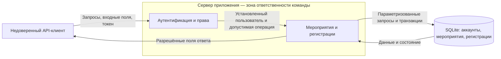

# Паспорт проекта

## Общие сведения

- **Название команды:** Three-cats.
- **Название продукта:** Three-cats Events.
- **Состав команды:** 3 участника; коды `M1`, `M2`, `M3`. Соответствие кодов участникам передаётся через закрытую регистрацию курса.
- **Статус ранней калибровки:** черновик; подтверждения преподавателя пока нет.
- **Ближайшая цель:** концепция безопасности и минимальная запускаемая техническая основа для EK1.

## 1. Назначение

Сервис помогает организатору собрать участников небольшого бесплатного мероприятия, а участнику — занять место и отменить запись при изменении планов. Сервер ведёт мероприятия и регистрации, проверяет полномочия и не допускает регистрации сверх вместимости. Предметная область выбрана из [примеров курса](https://github.com/hse-rbpo-bachelor-2026/course/blob/main/project-examples.md#2-система-управления-мероприятиями).

## 2. Граница продукта

**В продукт входит:**

- HTTP API мероприятий и регистраций;
- локальные учебные учётные записи и серверный контроль доступа;
- постоянное хранилище мероприятий, регистраций и учётных записей;
- проверка вместимости и состояний при изменении регистрации;
- инструкция локального запуска и проверки.

**Внешнее окружение:** компьютер с .NET SDK, локальная файловая система, API-клиент (`curl` или аналог). Пользователь управляет клиентом, но не сервером и файлом базы данных.

**Команда сознательно не реализует:** оплату, билеты, рассылки, внешнюю идентификацию, список ожидания, мобильное приложение и полноценный frontend.

## 3. Пользователи и доступные действия

| Пользователь или роль | Что может делать | Что ему недоступно |
| --- | --- | --- |
| Посетитель без входа | Читать публичные сведения об опубликованном мероприятии | Регистрироваться, видеть личные регистрации, черновики и списки участников |
| Участник | Записываться на доступное мероприятие, читать и отменять собственные регистрации | Выдавать себя за другого, отменять чужую регистрацию, публиковать мероприятия и читать чужие списки участников |
| Организатор | Создавать и публиковать свои мероприятия, закрывать запись, видеть их участников; участвовать в чужих мероприятиях как участник | Управлять чужими мероприятиями и читать их списки участников, назначать себе или другим новые роли через API |

Право организатора задаётся на сервере для учебных аккаунтов. В API нет функции самостоятельного повышения роли. Право на конкретное мероприятие зависит и от роли, и от его владельца.

## 4. Сквозные сценарии

### Сценарий 1. Опубликовать мероприятие

- **Участники:** организатор и посетитель.
- **Начальное условие:** организатор вошёл в систему; мероприятия ещё нет.
- **Основные действия:** организатор создаёт черновик с названием, описанием, временем начала и числом мест; проверяет сведения и публикует его.
- **Результат:** мероприятие доступно в публичном каталоге, на него можно записаться.
- **Что изменяется:** создаётся объект `Event`; состояние меняется с `draft` на `published`.

### Сценарий 2. Зарегистрироваться и посмотреть участников

- **Участники:** участник и организатор мероприятия.
- **Начальное условие:** мероприятие опубликовано, ещё не началось, есть свободное место.
- **Основные действия:** участник отправляет запрос регистрации; сервер определяет его личность, проверяет доступность места и сохраняет запись; участник видит свою запись, организатор — актуальный список.
- **Результат:** участнику выделено одно место; другие посетители не получают регистрационные сведения.
- **Что изменяется:** создаётся либо повторно активируется собственная `Registration`, число активных регистраций увеличивается на один.

### Сценарий 3. Отменить регистрацию и освободить место

- **Участники:** участник и следующий желающий записаться.
- **Начальное условие:** у участника есть активная регистрация, мероприятие ещё не началось.
- **Основные действия:** участник отменяет свою запись; сервер проверяет владельца и меняет состояние. Повтор того же запроса не освобождает дополнительное место.
- **Результат:** участник больше не занимает место; оно снова доступно, если запись на мероприятие открыта.
- **Что изменяется:** собственная регистрация переходит из `active` в `cancelled`.

## 5. Значимые данные и другие объекты

| Объект | Для кого имеет значение | Последствия раскрытия | Последствия изменения, удаления или недоступности |
| --- | --- | --- | --- |
| Мероприятие: владелец, название, описание, время, вместимость, состояние | Организатор и участники | Публичные сведения предназначены для публикации; черновик ещё не предназначен для посетителей | Подмена времени или вместимости вводит людей в заблуждение; подмена владельца отдаёт управление чужому аккаунту |
| Регистрация: мероприятие, участник, состояние | Участник и организатор соответствующего события | Посторонний узнаёт, какие мероприятия посещает пользователь | Чужая отмена лишает места; лишние или утраченные записи делают список и вместимость недостоверными |
| Учётная запись: идентификатор, роль, хеш пароля | Владелец аккаунта и сервер | Утечка данных входа создаёт риск действий от имени другого пользователя | Подмена роли или личности открывает управление чужими данными |

Применяются только вымышленные учебные аккаунты и мероприятия. ФИО, учебные группы и соответствие кодов участников команды GitHub-аккаунтам в паспорт не помещаются.

## 6. Компоненты и внешние взаимодействия

**Уже существует:** минимальный HTTP-сервер и публичный `GET /health`.

**Планируется:** предметные обработчики, локальная аутентификация и SQLite. Ниже показана целевая архитектура, а не уже реализованные компоненты.

Клиентские проверки не определяют права. На сервере проверяются личность, роль, владелец объекта и актуальное состояние. Потоки и границы разобраны в [модели угроз](docs/threat-model.md).

## 7. Откуда продукт получает данные

| Источник | Пример | Кто управляет | Как используется |
| --- | --- | --- | --- |
| JSON организатора | Название, описание, время, вместимость | API-клиент организатора | После проверки формируется собственный черновик |
| Параметр URL | Идентификатор мероприятия или регистрации | Любой API-клиент | Выбирает объект, но не даёт права на него |
| Данные входа и токен | Учебный логин, пароль, bearer-токен | Клиент предъявляет; сервер проверяет | После проверки сервер устанавливает пользователя |
| База данных | Владелец, роль, состояния, регистрации | Сервер приложения | Основание для проверки полномочий и выделения мест |
| Часы сервера | Текущее время UTC | Среда запуска | Проверка начала мероприятия |

Клиент не задаёт `OrganizerId`, `UserId`, роли или текущее число занятых мест как доверенные значения.

## 8. Минимальное функциональное ядро

**Обязательные функции конечного ядра:**

- локальный вход для подготовленных учебных аккаунтов;
- создание и публикация собственного мероприятия;
- публичный каталог без списков участников;
- регистрация, просмотр и отмена собственных записей;
- просмотр списка участников организатором своего мероприятия;
- сохранение состояния между перезапусками и защита последнего места при одновременных запросах.

**Предметные правила:**

- состояния мероприятия: `draft → published → closed`; закрытие прекращает новую запись, сохраняя существующие регистрации;
- заголовок: 1–120 символов после удаления пробелов по краям; описание: до 2000 символов;
- вместимость: 1–1000; дата начала при создании и публикации — в будущем;
- время хранится и сравнивается в UTC;
- после публикации время начала и вместимость не меняются в учебном ядре;
- записаться можно только на `published` до начала; отменить свою запись до начала можно и после закрытия новой записи;
- у пары «мероприятие — пользователь» одна запись со состоянием `active` или `cancelled`; повторная запись после отмены активирует её при наличии места;
- повторная отмена не меняет состояние и число доступных мест.

Проверяемость предметного правила сама по себе не делает его требованием безопасности. Защитный смысл и критерии приёмки выделены в [SR](docs/security-requirements.md).

**Можно исключить:** поиск, сортировку, редактирование опубликованных мероприятий, статистику и оформление интерфейса. Они не нужны для трёх основных сценариев.

## 9. Стек и путь к первой работающей версии

- **Текущая основа:** C#, .NET 10, ASP.NET Core Minimal API; дополнительных NuGet-зависимостей нет.
- **Планируемое хранение:** SQLite через EF Core.
- **Планируемый вход:** ASP.NET Core Identity с bearer-токенами; никаких собственных алгоритмов хеширования или подписи токенов.
- **Внешние сервисы для работы:** не требуются. После восстановления зависимостей сервер запускается локально.
- **Первый технический результат:** запускаемый сервер, HTTP `200` и JSON на `/health`.
- **Следующие результаты:** хранение мероприятий, вход и права, затем атомарная регистрация и отмена.

В этой локальной версии вход, БД и предметные маршруты не реализованы. `D-*` описывают выбранные способы будущей реализации, а не результаты выполненных проверок.

## 10. Локальный запуск

Требования к окружению, команды сборки и запуска, запрос проверки и ожидаемый ответ находятся в [README](README.md#локальный-запуск). Проверка `/health` подтверждает только работу минимального сервера.

## Материалы концепции безопасности

- [Требования `SR-*`](docs/security-requirements.md).
- [Модель угроз `T-*`](docs/threat-model.md).
- [Решения `D-*` и будущие проверки](docs/design-decisions.md).
- [Вклад участников](CONTRIBUTIONS.md).

## Состояние подготовки к сдаче

Подготовлены паспорт, SR, T, D и документ о вкладе. Реализован только `/health`; проверки защитных механизмов остаются будущими.

